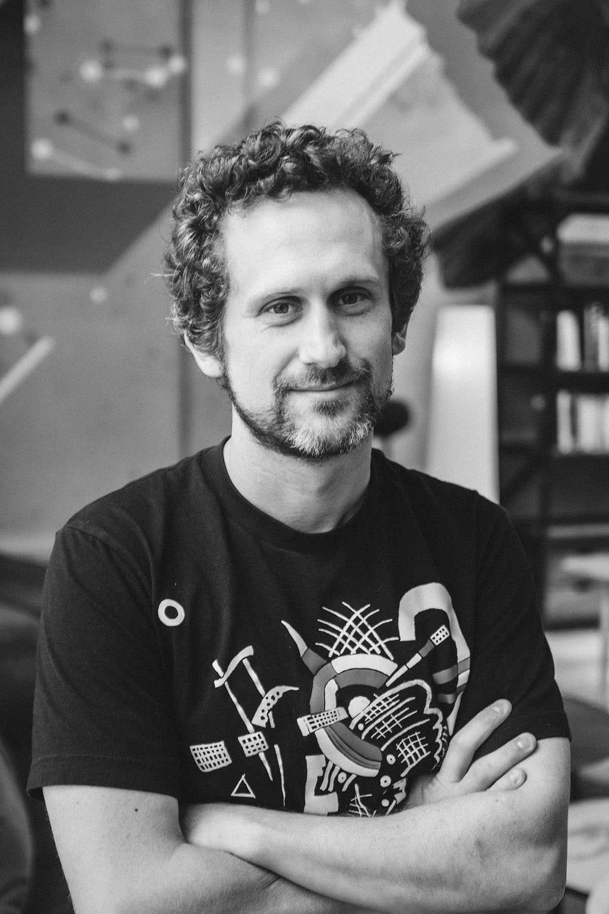
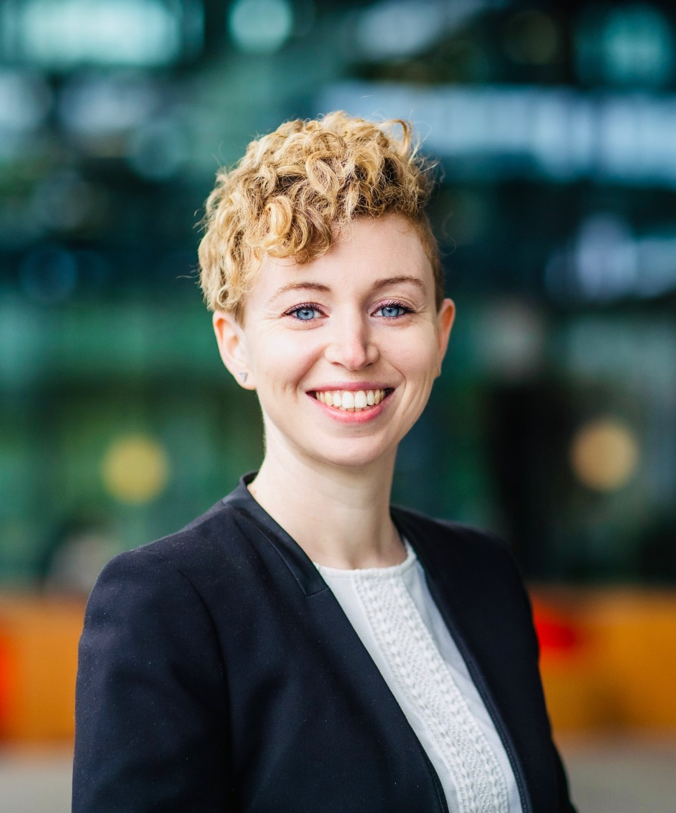
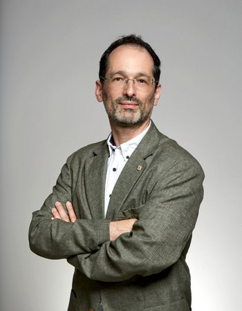
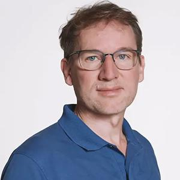
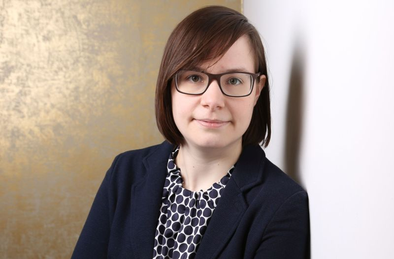

Agentic large language model systems are moving from conversational and coding assistants to co-scientists in the molecular sciences, such as planning syntheses, calling domain tools, and closing experimental loops with laboratory automation. Recent demonstrations span autonomous drug repurposing, retrosynthesis, and genome-wide virtual screening, all built on stacks of learned representations, predictors, and simulators. Yet careful benchmarking has exposed striking failures at seemingly simple tasks: tool-augmented agents reach only around 50% accuracy on chemical cost estimation, chemistry language models fail systematic symbolic reasoning on molecular graphs, and single-cell foundation models for perturbation prediction do not outperform linear baselines. This workshop takes the contrast between agentic ambition and methodological fragility as its starting point with explicit space for negative results, rigorous baselines, and benchmark contributions alongside methodological advances.

## Call for Papers

We invite submissions to **Agentic Systems for Molecular Sciences**, a NeurIPS 2026 workshop taking place in Paris on 12 or 13 December.

Agentic systems are only as good as the representations, predictors, generative models, and simulators they orchestrate. Progress on the agentic frontier depends on progress in the underlying machine learning methods, and on honest evaluation of both. We invite submissions across the full stack, from foundational methods to end-to-end agents, including negative results, careful baselines, and benchmark contributions alongside methodological advances. We welcome participation from machine learning researchers, chemists, biologists, materials scientists, and interdisciplinary practitioners, and encourage submissions from early-career and underrepresented authors.

### Topics of interest

Topics include, but are not limited to:

- Agentic and multi-agent systems for the molecular sciences; tool use, planning, and orchestration
- Benchmarks, reproducibility, negative results, and rigorous evaluation of scientific agents and their components
- Grounding LLMs via chemical databases, simulators, and experimental feedback
- Closed-loop / self-driving labs, active learning, and Bayesian optimization for experimental design
- Foundation models for chemistry, biology, and materials, and their benchmarking
- Representation learning and generative models for molecules, proteins, reactions, and materials
- Bioactivity, ADME, toxicity, and molecular property prediction
- Reaction prediction, retrosynthesis, and synthesis planning
- Structure-based and ligand-based virtual screening; docking, scoring, and protein–ligand / protein–protein interaction prediction
- Perturbation modelling, batch effect correction, domain adaptation and single-cell prediction
- Machine-learned interatomic potentials, force fields, molecular dynamics, and geometric / equivariant / physics-informed deep learning

Contributions that clarify what current methods **can and cannot** do, including negative results, careful ablations, and rigorous baselines, are especially welcome.

### Submission guidelines

**Format.** Submissions must use the [NeurIPS 2026 workshop LaTeX template](https://media.neurips.cc/Conferences/NeurIPS2026/Formatting_Instructions_For_NeurIPS_2026.zip). The main text is limited to maximum **5 content pages**, including all figures and tables. References and appendices do not count toward the page limit, but reviewers are not obliged to read supplementary material — the main text must be self-contained. The NeurIPS checklist is not required. Maximum file size: 50 MB.

**Anonymity.** Reviewing is **double-blind**. Submissions must be anonymized, with author names, affiliations, and acknowledgments removed, and prior work cited in the third person.

**Submission site.** Submissions are managed via **OpenReview**. Papers remain private during review. All authors should maintain up-to-date OpenReview profiles for conflict-of-interest management and paper matching. Submission site: [OpenReview](https://openreview.net/group?id=NeurIPS.cc/2026/Workshop/ML4Molecules)

**Non-archival policy.** The workshop is non-archival. Papers under review elsewhere are welcome, and accepted papers may be published at other venues afterward. Work already published at NeurIPS or other archival ML venues should not be submitted; substantial extensions of prior non-ML-venue work are eligible.

**Presentation.** Accepted contributions are presented as **posters**, with a subset selected for **contributed talks**. Contributed-talk slots are reserved for early-career first authors. A **Best Paper Award** will be given for the strongest overall contribution.

## Important Dates

- **Call for papers:** mid-July 2026
- **Submission deadline:** 29 August 2026 (AOE)
- **Reviewing:** 30 August – 24 September 2026
- **Author notification:** 29 September 2026
- **Workshop:** 12 or 13 December 2026 · Paris

Submissions are reviewed on OpenReview. The workshop is non-archival.

## Invited Speakers

  

    
    

      <h3><a href="https://www.futurehouse.org/team/andrew-white">Andrew White</a></h3>
      FutureHouse
      
Co-founder and head of science at FutureHouse; pioneer of agentic AI systems for science (ChemCrow, ether0, PaperQA).

    

  

  

    
    

      <h3><a href="https://www.tue.nl/en/research/researchers/francesca-grisoni">Francesca Grisoni</a></h3>
      TU Eindhoven
      
Associate Professor leading the Molecular Machine Learning team, bridging AI and the wet-lab for drug discovery.

    

  

  

    
    

      <h3><a href="https://atomlab.yanyanlan.com/lanyanyan/">Yanyan Lan</a></h3>
      Tsinghua University
      
Deputy Dean and professor at the Institute for AI Industry Research (AIR); machine learning, information retrieval, and AI for Science.

    

  

  

    
    

      <h3><a href="https://www.eng.cam.ac.uk/profiles/gc121">Gábor Csányi</a></h3>
      University of Cambridge &amp; Max Planck Institute for Polymer Research
      
Pioneer of machine-learning interatomic potentials and first-principles property prediction.

    

  

  

    
    

      <h3><a href="https://jpvert.github.io/">Jean-Philippe Vert</a></h3>
      Bioptimus
      
Co-founder and CEO of Bioptimus, building foundation models for biology and medicine; member of the French National Academy of Technologies.

    

  

  

    
    

      <h3><a href="https://schwallergroup.github.io/">Philippe Schwaller</a></h3>
      EPFL
      
Assistant Professor leading the Laboratory of Artificial Chemical Intelligence; AI-accelerated synthesis and chemical reasoning.

    

  

  

    
    

      <h3><a href="https://jageo.github.io/about/">Janine George</a></h3>
      FSU Jena &amp; BAM Berlin
      
Professor of Materials Informatics; data-driven materials discovery combining high-throughput DFT and machine learning.

    

  

## Organizers

<strong><a href="https://ellis.eu/person/nadine-schneider">Nadine Schneider</a></strong>, <em>Novartis</em> 
<strong><a href="https://www.jku.at/en/institute-for-machine-learning/about-us/team/univ-prof-mag-dr-guenter-klambauer/">Günter Klambauer</a></strong>, <em>ELLIS Unit Linz &amp; Johannes Kepler University Linz</em> 
<strong><a href="https://www.chalmers.se/en/persons/olae/">Ola Engkvist</a></strong>, <em>AstraZeneca &amp; Chalmers University of Technology</em> 
<strong><a href="https://www.microsoft.com/en-us/research/people/marwinsegler/">Marwin Segler</a></strong>, <em>Microsoft Research</em> 
<strong><a href="https://www.jku.at/en/institute-for-machine-learning/about-us/team/dr-sohvi-luukkonen/">Sohvi Luukkonen</a></strong>, <em>ELLIS Unit Linz &amp; Johannes Kepler University Linz</em>

## Preliminary Schedule (subject to changes)

| Time          | Duration | Session                                                                                                                                  |
|---------------|----------|------------------------------------------------------------------------------------------------------------------------------------------|
| 9:00 – 9:10   | 10 min   | **Opening remarks**                                                                        |
| 9:10 – 10:20  | 70 min   | **Block 1**: 2 invited talks (20 min each) + 1 contributed talk (10 min) + **20 min discussion** |
| 10:20 – 10:50 | 30 min   | ☕ **Morning coffee break & posters on display**                                                                                        |
| 10:50 – 12:00 | 70 min   | **Block 2**: 2 invited (20 min) + 1 contributed (10 min) + **20 min discussion**                    |
| 12:00 – 13:00 | 60 min   | 🍽️ **Lunch break & posters on display**                                                                                               |
| 13:00 – 14:10 | 70 min   | **Block 3**: 2 invited (20 min) + 1 contributed (10 min) + **20 min discussion**                         |
| 14:10 – 15:10 | 60 min   | **Block 4**: 1 invited (20 min) + 1 best-paper talk (10 min) + 1 contributed (10 min) + **20 min discussion** |
| 15:10 – 15:40 | 30 min   | ☕ **Afternoon coffee break & posters on display**                                                                                   |
| 15:40 – 16:40 | 60 min   | 🎙️ **Panel discussion**                                            |
| 16:40 – 17:50 | 70 min   | 🖼️ **Dedicated poster session**                                                                                    |
| 17:50 – 18:00 | 10 min   | **Closing remarks**                                                                                          |

## Supporters

The workshop proposal is supported by the [ELLIS unit Linz](https://ellis.eu/research/sites/unit-linz) and the [ELLIS unit Cambridge](https://ellis.eu/research/sites/unit-cambridge).

## Sponsors
Contact us at [ml4molecules@ml.jku.at](mailto:ml4molecules@ml.jku.at) to support this workshop.

## Contact
For questions about the workshop, contact us at [ml4molecules@ml.jku.at](mailto:ml4molecules@ml.jku.at).
